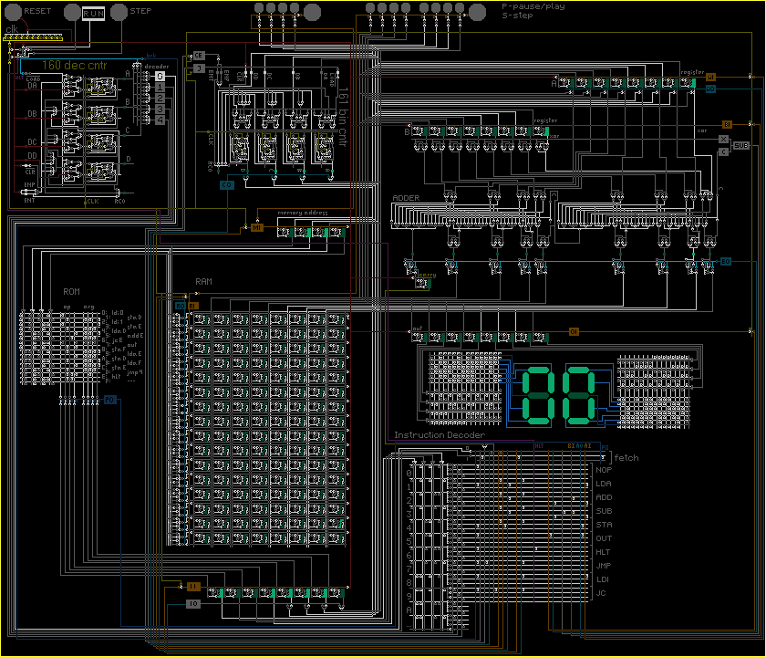
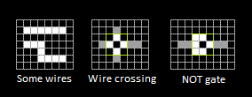

# Bitmap Wire Logic Simulator

A simple and visual bitmap simulation of a real 8-bit microprocessor to explain the very low-level principles of operation (lower than assembler).

## The Rules

### Rule 1: directly connected cells are the same wire
### Rule 2: the intersection of wires through a not-a-wire is a wire crossing
### Rule 3: the special pattern (including rotations) is a NOT gate

## Published at
* (ru) https://iaaa.github.io/wire-logic/
* (en) not ready yet, but soon.

## Credits
> *I saw the idea at [Bitmap Logic Simulator](https://realhet.wordpress.com/2015/09/02/bitmap-logic-simulator/) and a bit simplified.*

https://www.instructables.com/How-to-Build-an-8-Bit-Computer/  
https://realhet.wordpress.com/2015/09/02/bitmap-logic-simulator/  
https://www.dafont.com/i-pixel-u.font  
https://web.archive.org/web/20160725210001/https://karlscherer.com/Wireworld.html  
