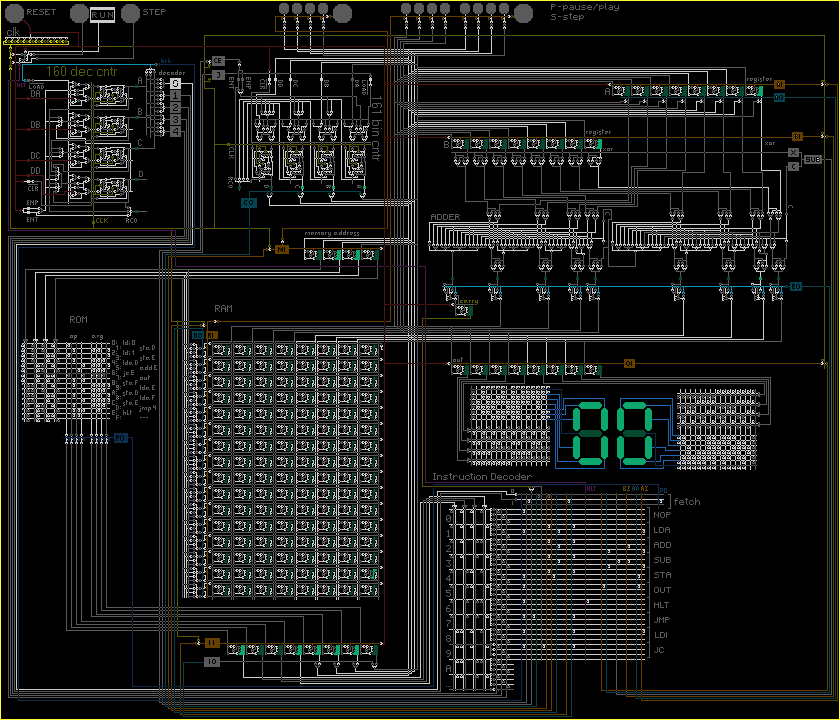

# {{ page.title }}

Это страничка очень простого и вполне доходчивого объяснения самых низкоуровневых основ организации работы микропроцессоров (ниже только физические принципы функционирования транзисторов). Настолько простого, что не составит труда объяснить даже школьникам средних классов. Проверено.

> *Проект был вдохновлен страничкой [Bitmap Logic Simulator](https://realhet.wordpress.com/2015/09/02/bitmap-logic-simulator/){:target="_blank"}, наша им большая благодарность.*

# Зачем

Если вы хотите понять, как именно бинарные команды размещаются в физической памяти и кеше, как они оттуда в нужном порядке попадают в процессор, как процессор их декодирует в управление и как именно он управляет регистрами, АЛУ, вводом и выводом, да и вообще как вот это все вместе работает, то вам сюда.

# Как

Анимированной картинкой. Вот такой (внимание на большой изумрудный цифровой индикатор):

Что-то знакомое, да? Напоминает [микрофотографии процессорных кристаллов](https://en.wikipedia.org/wiki/Die_(integrated_circuit)){:target="_blank"}, только в динамике.

# Что

Мы с вами построим полноценный 8-битный микропроцессор, который умеет:
* работать на некоторой тактовой частоте,
* выполнять записанную в ПЗУ программу,
* складывать и вычитать два регистра,
* делать условный переход (в нашем случае по флажку CF),
* записывать в ОЗУ и читать оттуда,
* выводить значение регистра в порт вывода (к коему мы подключим цифровой индикатор чтобы видеть, что было записано),
* и, наконец, останавливаться.

*(если текст выше для вас прозвучал абракадаброй - не страшно, расшифровка будет).*

[Продолжайте...](introduction.html)
